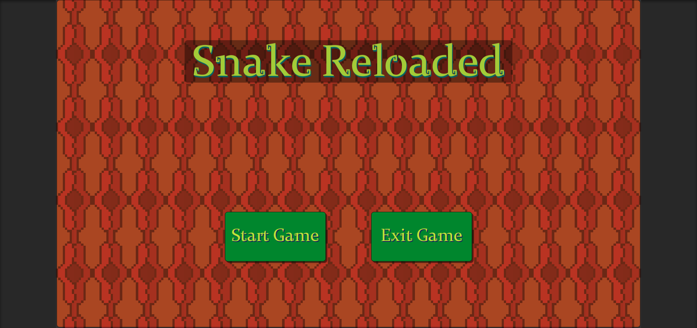
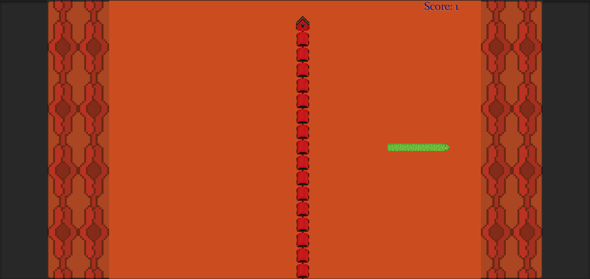
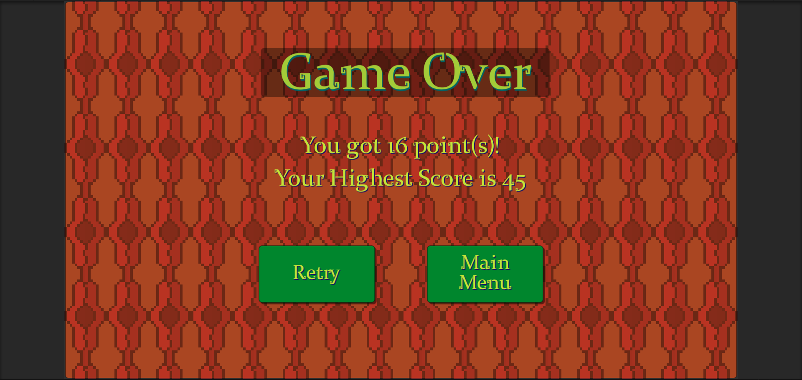

# Snake Reloaded

This is a personal project made in Unity.

Snake Reloaded is based on the snake game concept, with some twists added.

## Some important links

**Gameplay video**: https://youtu.be/AB1cL5b7Ihw

**Itchio page to play the game**: https://big-thor.itch.io/snake-reloaded

## Game mechanics
* Player is constantly moving in the direction that is facing.
* Player can change direction either with keyboard or controller.
* Player can go through the edge of the play area to appear on the other side.
* Player will die if they collide either with himself or an obstacle.
* Food spawns at a set interval, which can be eaten by the player to earn score.
* Eating food grows the player.
* Trains (moving obstacles) spawn at a set interval, and they traverse the play area until they are outside.

## Screenshots

Main Menu

Gameplay

Game Over

## Planned future updates
* Add music to Game Over screen
* Add snake types with diverse benefits.
* Add currency, earned by obtaining points, to unlock/upgrade snakes.
* Add different difficulties.

## Credits

**Font**: Made by Karla Vazquez 
https://www.dafont.com/mayan-2.font

**Music**: Made by myself using Bosca Ceoil
https://boscaceoil.net/downloads.html

**Sound Effects**: Made by myself using Audacity
https://www.audacityteam.org/

**Pixel Art**: Made by myself using Aseprite
https://www.aseprite.org/
